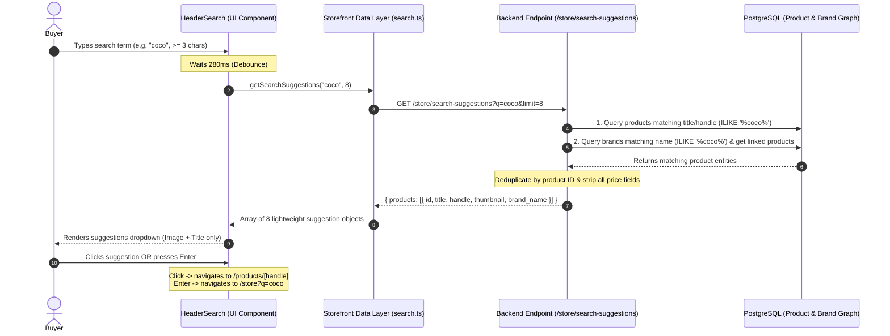

# Auto Search Suggestions Implementation Guide

This document provides a comprehensive technical overview of how the **Header Auto Search Suggestions** and **Full Catalog Search** features are built in the IngredientsBazar Medusa v2 project.

---

## 1. High-Level Architecture



---

## 2. Key Business Rules & Requirements

| Requirement | Implementation |
| :--- | :--- |
| **Trigger Threshold** | Queries only execute once the buyer enters **3 or more characters** (`length >= 3`). Sub-3 character inputs return empty results immediately. |
| **Debounce** | Input keystrokes are debounced by **280ms** to prevent redundant API calls while the buyer is actively typing. |
| **No Prices in Suggestions** | **Strictly enforced**: The suggestions endpoint and UI only expose `id`, `title`, `handle`, `thumbnail`, and `brand_name`. Price calculations are excluded. |
| **Result Cap** | Autocomplete results are capped at **8 items**. |
| **Dual Matching** | Matches both **Product Name / Handle** and **Brand Name** simultaneously, combining and deduplicating results. |
| **Enter Key Action** | Pressing <kbd>Enter</kbd> or clicking *"View all results for..."* routes to `/[countryCode]/store?q={query}` to view the full paginated catalog grid. |

---

## 3. Implementation Breakdown

### A. Brand Custom Module & Product Link

Since brand was not originally stored as a relational field, a custom `brand` module was created and linked to the `product` module in the Medusa backend.

#### 1. Brand Data Model
- **File**: `apps/backend/src/modules/brand/models/brand.ts`
- Defines the `brand` model with `id`, `name`, `handle`, and `description`.

#### 2. Brand Service & Module Definition
- **Files**: `apps/backend/src/modules/brand/service.ts`, `apps/backend/src/modules/brand/index.ts`
- Extends `MedusaService({ Brand })` and exports `Module("brand", ...)`.

#### 3. Product-to-Brand Module Link
- **File**: `apps/backend/src/links/product-brand.ts`
- Links `ProductModule.linkable.product` with `BrandModule.linkable.brand`.

#### 4. Medusa Configuration & Database Migration
- **Config**: Registered in `apps/backend/medusa-config.ts` under `modules`.
- **Migration**: `apps/backend/src/modules/brand/migrations/Migration20260929000000.ts` creates the `brand` table and link table `product_product_brand_brand`.

---

### B. Backend Search Suggestions Endpoint

- **File**: `apps/backend/src/api/store/search-suggestions/route.ts`
- **Method**: `GET /store/search-suggestions?q={query}&limit={limit}`

#### Logic Flow:
1. Validates query parameter `q` (minimum 3 characters).
2. Executes dual graph queries using Medusa's `query.graph`:
   - **Product Query**: Finds products where `title` or `handle` matches `%$q%` using `$ilike`.
   - **Brand Query**: Finds brands where `name` matches `%$q%` and retrieves the linked published products.
3. Merges and deduplicates products by `product.id`.
4. Maps results to a lightweight representation without prices:
   ```json
   {
     "products": [
       {
         "id": "prod_01...",
         "title": "Callebaut Cocoa Butter 1kg",
         "handle": "callebaut-cocoa-butter-1kg",
         "thumbnail": "https://...",
         "brand_name": "Callebaut"
       }
     ]
   }
   ```

---

### C. Storefront Data Layer

- **File**: `apps/storefront/src/lib/data/search.ts`
- Exports the Server Action `getSearchSuggestions(query, limit = 8)`.
- Calls `/store/search-suggestions` with `no-store` cache configuration for real-time responsiveness.
- Includes fallback logic to `/store/products?q=...` if the suggestions endpoint is unreachable.

---

### D. Header Search Component (UI/UX)

- **Component**: `apps/storefront/src/modules/layout/components/header-search/index.tsx`
- **Header Template**: `apps/storefront/src/modules/layout/templates/nav/index.tsx`

#### UI Highlights:
- **Search Input**: Clean rounded search input with search icon, live loading spinner, and quick-clear (`✕`) button.
- **Debounced Listener**: `useEffect` hook waits 280ms between keystrokes before invoking `getSearchSuggestions`.
- **Suggestions Dropdown**:
  - Displays thumbnail image, product name, and brand tag.
  - No price displayed anywhere.
  - Hover highlights and keyboard navigation support.
  - Click outside detection automatically dismisses dropdown.
- **Enter / Submit**: Navigates to `/[countryCode]/store?q=${encodeURIComponent(query)}`.

---

### E. Full Results Store Page

- **Page Route**: `apps/storefront/src/app/[countryCode]/(main)/store/page.tsx`
- **Store Template**: `apps/storefront/src/modules/store/templates/index.tsx`
- **Product Listing**: `apps/storefront/src/modules/store/templates/paginated-products.tsx`

#### Search Page Features:
- Dynamically updates page title to `Search results for "{q}"` when `q` is present.
- Forwards `q` into the product query params to load full paginated matching products.
- Renders an informative empty state (*"No products found matching '{q}'"*) when 0 results match.

---

## 4. File Directory Index

```text
apps/
├── backend/
│   ├── src/
│   │   ├── api/store/search-suggestions/
│   │   │   └── route.ts                      # Backend suggestions REST API endpoint
│   │   ├── links/
│   │   │   └── product-brand.ts              # Product <-> Brand module link definition
│   │   └── modules/brand/
│   │       ├── index.ts                      # Brand module definition
│   │       ├── service.ts                    # Brand module service
│   │       ├── models/brand.ts               # Brand data model
│   │       └── migrations/                   # Database migration for brand
│   └── medusa-config.ts                      # Medusa configuration registering brand module
└── storefront/
    └── src/
        ├── app/[countryCode]/(main)/store/
        │   └── page.tsx                      # Store search results page route
        ├── lib/data/
        │   └── search.ts                     # Storefront search server action
        └── modules/
            ├── layout/
            │   ├── components/header-search/
            │   │   └── index.tsx             # Interactive search input & dropdown component
            │   └── templates/nav/
            │       └── index.tsx             # Navigation header embedding HeaderSearch
            └── store/templates/
                ├── index.tsx                 # Store template handling search query heading
                └── paginated-products.tsx    # Paginated product grid with search filtering
```
