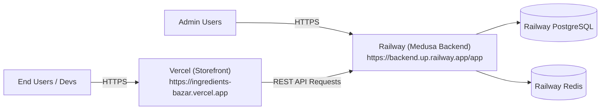

# Development Deployment Guide (Vercel + Railway)

This guide walks you through deploying the **DEV environment** with **Zero-DevOps**:
- **Medusa Backend + PostgreSQL + Redis** on **Railway**
- **Next.js Storefront** on **Vercel**

---

## 1. Architecture Overview



---

## 2. Part 1: Deploy Backend, PostgreSQL & Redis on Railway

### Step 1: Create a Railway Project
1. Go to [railway.app](https://railway.app) and log in with GitHub.
2. Click **New Project** ➔ **Provision PostgreSQL**.
3. In the same project, click **New Service** ➔ **Database** ➔ **Add Redis**.

### Step 2: Deploy the Medusa Backend Service
1. In the same Railway project, click **New Service** ➔ **GitHub Repo** ➔ select this repository.
2. Under **Settings**:
   - **Build**: Ensure it points to `Dockerfile.backend` (Railway picks up [`railway.json`](file:///c:/Users/phane/.gemini/antigravity-ide/scratch/ingredients-bazar-medusa/medusa-poc/railway.json) automatically).
   - **Networking**: Click **Generate Domain** (e.g. `https://medusa-production-xxxx.up.railway.app`).

### Step 3: Configure Backend Environment Variables
In Railway ➔ Your Backend Service ➔ **Variables** tab, add:

| Variable | Value (use Railway variables) |
| :--- | :--- |
| `DATABASE_URL` | `${{Postgres.DATABASE_URL}}` *(automatic reference)* |
| `REDIS_URL` | `${{Redis.REDIS_URL}}` *(automatic reference)* |
| `PORT` | `9000` |
| `NODE_ENV` | `production` |
| `JWT_SECRET` | `dev_jwt_secret_super_safe_random_123` |
| `COOKIE_SECRET` | `dev_cookie_secret_super_safe_random_123` |
| `STORE_CORS` | `https://*.vercel.app,http://localhost:8000` |
| `ADMIN_CORS` | `https://*.up.railway.app,http://localhost:9000` |
| `AUTH_CORS` | `https://*.vercel.app,https://*.up.railway.app,http://localhost:8000,http://localhost:9000` |

### Step 4: Create Admin User & Seed Data
Open the Railway backend service, go to the **CLI / Terminal** tab:
```bash
# Create initial admin user
npx medusa user -e admin@ingredientsbazar.com -p SuperSecretAdminPass123!

# Run seed script
pnpm run backend:seed
```

---

## 3. Part 2: Deploy Storefront on Vercel

### Step 1: Import Project into Vercel
1. Go to [vercel.com](https://vercel.com) and click **Add New Project**.
2. Select this GitHub repository.
3. Configure the project:
   - **Framework Preset**: `Next.js`
   - **Root Directory**: `apps/storefront`

### Step 2: Add Environment Variables in Vercel
Add the following in Vercel Project Settings:

| Key | Value |
| :--- | :--- |
| `NEXT_PUBLIC_MEDUSA_BACKEND_URL` | `https://your-backend-domain.up.railway.app` |
| `MEDUSA_BACKEND_URL` | `https://your-backend-domain.up.railway.app` |
| `NEXT_PUBLIC_DEFAULT_REGION` | `in` |
| `NEXT_PUBLIC_BASE_URL` | `https://your-storefront.vercel.app` |
| `NEXT_PUBLIC_MEDUSA_PUBLISHABLE_KEY` | *(Create one in Medusa Admin under Settings > Publishable API Keys)* |

### Step 3: Click Deploy
Vercel builds and deploys your Next.js storefront live on their global CDN.

---

## 4. Environment Matrix (Dev vs Prod)

| Layer | Development (Fast & Zero-Ops) | Production (Enterprise AWS via Terraform) |
| :--- | :--- | :--- |
| **Storefront** | Vercel (`apps/storefront`) | AWS ECS Fargate or Vercel Edge |
| **Backend** | Railway (`Dockerfile.backend`) | AWS ECS Fargate ([`terraform/modules/ecs`](file:///c:/Users/phane/.gemini/antigravity-ide/scratch/ingredients-bazar-medusa/medusa-poc/terraform/modules/ecs)) |
| **Database** | Railway PostgreSQL | Amazon RDS PostgreSQL 15 ([`terraform/modules/rds`](file:///c:/Users/phane/.gemini/antigravity-ide/scratch/ingredients-bazar-medusa/medusa-poc/terraform/modules/rds)) |
| **Redis** | Railway Redis | Amazon ElastiCache Redis ([`terraform/modules/redis`](file:///c:/Users/phane/.gemini/antigravity-ide/scratch/ingredients-bazar-medusa/medusa-poc/terraform/modules/redis)) |
| **File Storage**| Local / S3 | Amazon S3 ([`terraform/modules/s3`](file:///c:/Users/phane/.gemini/antigravity-ide/scratch/ingredients-bazar-medusa/medusa-poc/terraform/modules/s3)) |
| **Networking** | Railway DNS + Vercel Edge | AWS VPC, ALB, NAT Gateway ([`terraform/modules/vpc`](file:///c:/Users/phane/.gemini/antigravity-ide/scratch/ingredients-bazar-medusa/medusa-poc/terraform/modules/vpc)) |
